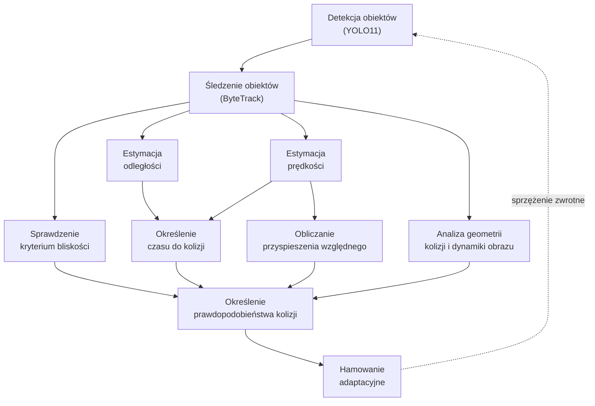

# Vision-Based Automatic Emergency Braking (VAEB)
System automatycznego hamowania awaryjnego oparty wyłącznie na obrazie z kamery.

## Opis projektu

VAEB jest modułowym systemem wspomagania kierowcy (ADAS), którego celem jest wykrywanie zagrożeń kolizyjnych na podstawie obrazu z pojedynczej kamery oraz podejmowanie decyzji o hamowaniu awaryjnym.

Projekt testowany był w środowisku symulacyjnym CARLA. System wykorzystuje detekcję i śledzenie obiektów oraz analizę ich ruchu w celu oszacowania prawdopodobieństwa kolizji i aktywacji hamowania awaryjnego.

## Architektura systemu


## Struktura projektu

Poniżej znajduje się główna struktura plików i folderów w projekcie:
```text
AED
|   detect_danger.ipynb
|   main.py
|   raport.txt
|   README.md
|   requirements.txt
|   summary.csv
|   
+---config
|       consts.py
|       __init__.py
|       
+---env
|       carla.py
|       test.py
|       __init__.py
|       
+---logger
|       setup.py
|       __init__.py
|       
+---logs
|       aeb_critical.log
|       aeb_warning.log
|       
+---tests
|   |   test_runner.py
|   |   __init__.py
|   |   
|   \---scenarios
|           base_scenario.py
|           scenarios.py
|           __init__.py
|           
\---utils
        control.py
        danger.py
        physics.py
        vision.py
        __init__.py
```

## Cytacja
```text
@software{sadowski2025vaeb,
  author = {Sadowski, Marcin},
  title = {Design and implementation of an automatic emergency braking system},
  year = {2025},
  url = {https://github.com/masadows/vaeb}
}
```
